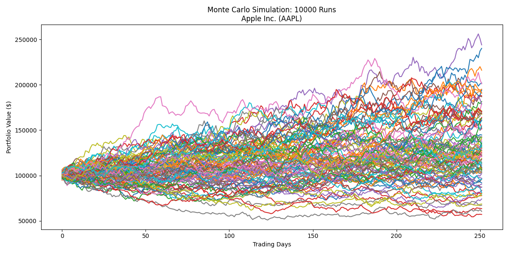
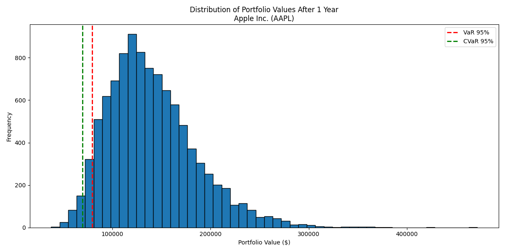
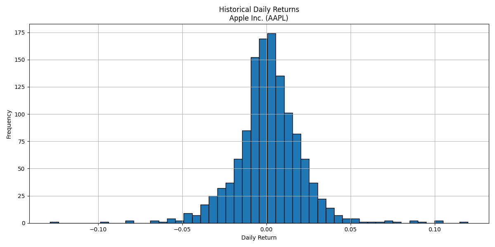

# Monte Carlo Simulation for Risk Assessment

This project implements a Monte Carlo simulation for financial risk assessment using historical stock data. It provides insights into potential future portfolio values and key risk metrics.

## Sample Visualizations

This graph shows multiple potential paths for the portfolio value over time. Each line represents a single simulation run.

This histogram displays the distribution of final portfolio values after the simulation period. The red line indicates the Value at Risk (VaR), and the green line shows the Conditional Value at Risk (CVaR).

This histogram shows the distribution of historical daily returns for the selected stock.

## How the Program Works

1. **Data Fetching**:

   - The program uses the `yfinance` library to fetch historical stock data for a specified ticker.
   - It retrieves 5 years of daily closing prices and calculates daily returns.

2. **Monte Carlo Simulation**:

   - Using the historical data, the program calculates the mean daily return and volatility.
   - It then generates thousands of potential future scenarios (10,000 by default) using these parameters.
   - Each scenario simulates daily returns for a specified time horizon (default is 252 trading days, or about 1 year).

3. **Risk Metrics Calculation**:

   - Value at Risk (VaR): Calculated at the 95% confidence level. This represents the minimum loss expected in the worst 5% of scenarios.
   - Conditional Value at Risk (CVaR): Also known as Expected Shortfall, this is the average loss in the worst 5% of scenarios.

4. **Visualization**:
   - Monte Carlo Paths: Plots 100 sample paths to visualize potential portfolio value trajectories.
   - Final Value Distribution: A histogram of final portfolio values across all simulations, with VaR and CVaR marked.
   - Historical Returns: A histogram of the stock's historical daily returns for context.

## Key Components

1. `fetch_stock_data(ticker, start_date, end_date)`:

   - Fetches historical stock data and returns daily returns and company name.

2. `monte_carlo_simulation(returns, num_simulations, initial_investment, time_horizon)`:

   - Generates simulated future scenarios based on historical data.

3. `calculate_var(final_values, confidence_level)` and `calculate_cvar(final_values, confidence_level)`:
   - Calculate VaR and CVaR risk metrics.

## Interpretation of Results

- The Monte Carlo paths show the range of potential outcomes for the portfolio.
- The final value distribution gives insight into the likelihood of different portfolio values after the simulation period.
- VaR tells us the minimum loss we might expect in the worst 5% of cases.
- CVaR gives us the average loss in those worst 5% of cases, providing insight into potential severe losses.
- The historical returns distribution provides context for the stock's past performance and volatility.

## Usage

1. Ensure you have the required libraries installed (`numpy`, `matplotlib`, `yfinance`).
2. Run the script, specifying the stock ticker, investment amount, and other parameters as desired.
3. Analyze the output graphs and risk metrics to inform investment decisions.

## Limitations and Future Improvements

- This model assumes returns are normally distributed, which may not always be the case in real markets.
- It doesn't account for factors like changing volatility, market conditions, or company-specific events.
- Future improvements could include multi-stock portfolio simulation, more advanced return models, and additional risk metrics.
